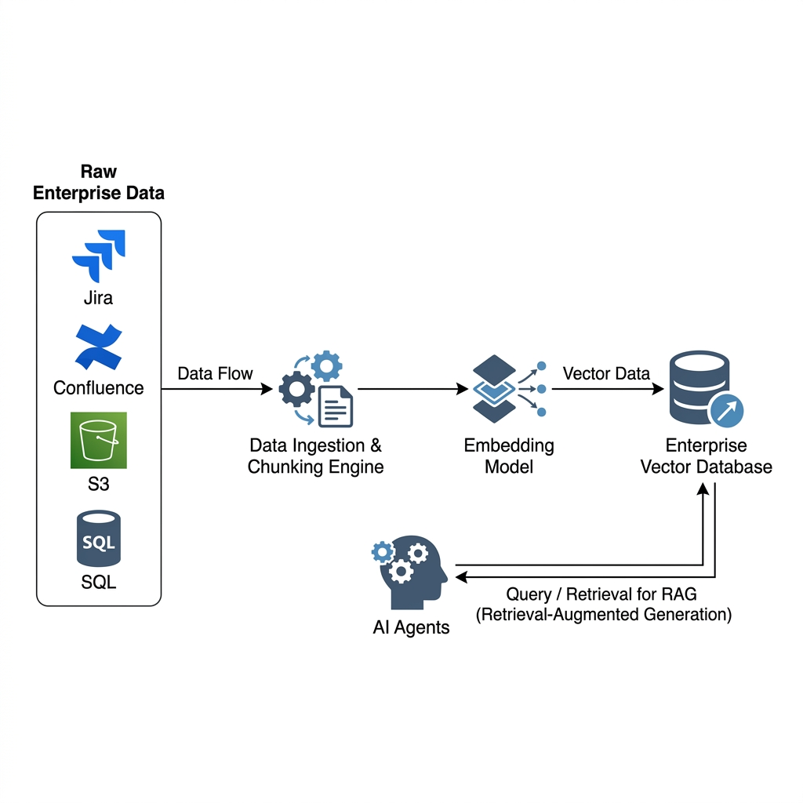
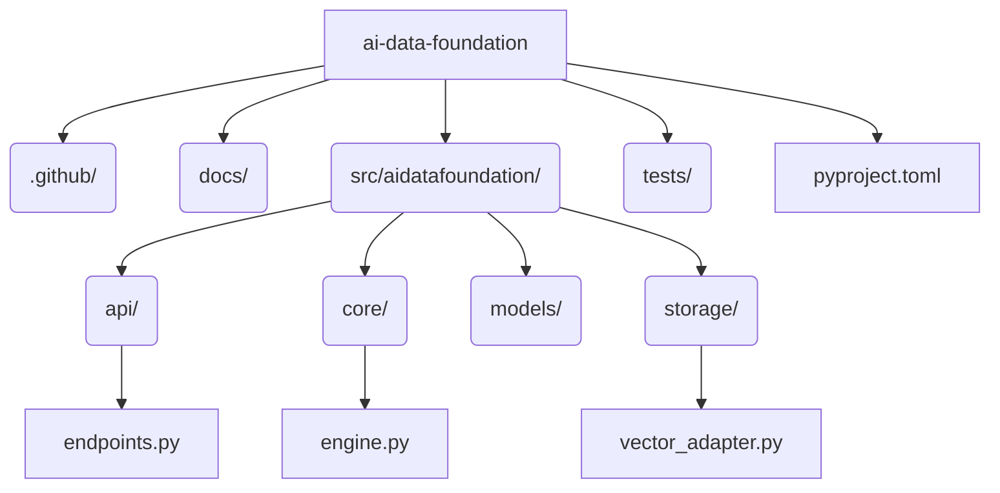

<div align="center">
  
</div>

<h1 align="center">AI Data Foundation</h1>

<p align="center">
  <strong>Enterprise Data Pipeline for Retrieval-Augmented Generation (RAG)</strong>
</p>

---

## 1. Executive Summary

AI Agents are only as intelligent as the data they can access. The **AI Data Foundation** is the core infrastructure layer that supplies contextual knowledge to the DevopsTrio Agent Ecosystem.

This component ingests raw, unstructured enterprise data from sources like Jira, Confluence, and S3, chunks the text, passes it through an Embedding Model to generate vector representations, and securely stores them in an Enterprise Vector Database (e.g., Pinecone, Milvus, pgvector). Autonomous AI Agents then query this foundation layer to retrieve highly relevant context snippets, enabling powerful Retrieval-Augmented Generation (RAG) capabilities.

---

## 2. High-Level Design (HLD)

<div align="center">
  
  <br/>
  <em>Figure 1: Raw data flows through the Ingestion & Chunking Engine, gets embedded, and is queried by AI Agents.</em>
</div>

### Operational Flow
1. **Data Ingestion**: A data connector pulls a new Confluence page and sends it to `POST /v1/data/ingest`.
2. **Chunking & Embedding**: The engine splits the page into 500-character chunks, calls an embedding model (like `text-embedding-v3`) to vectorize them, and writes them to the Vector Database.
3. **Retrieval**: A Support Agent needs to answer a user's question. It queries `POST /v1/data/search` with the user's question. The engine embeds the question, performs a semantic similarity search in the Vector DB, and returns the top 5 most relevant documentation chunks.

---

## 3. Low-Level Design (LLD)

### 3.1 Tech Stack
* **Framework**: FastAPI (Python 3.12)
* **Embedding/Vector Logic**: Core Python engine connected to an async Vector Storage Adapter.
* **Testing**: PyTest with Mocked Vector Storage.

### 3.2 Folder Architecture



---

## 4. API Specification

### 4.1 Ingest Document
```bash
curl -X POST http://localhost:8015/v1/data/ingest \
  -H "Content-Type: application/json" \
  -d '{
    "source_id": "confluence-1234",
    "content": "To connect to the VPN, you must use Cisco AnyConnect...",
    "metadata": {"author": "IT Dept"}
  }'
```

### 4.2 Search RAG Context
```bash
curl -X POST http://localhost:8015/v1/data/search \
  -H "Content-Type: application/json" \
  -d '{
    "query": "How do I access the VPN?",
    "top_k": 3
  }'
```
**Response**:
```json
{
  "results": [
    {
      "chunk_id": "550e8400-e29b-41d4-a716-446655440000",
      "source_id": "confluence-1234",
      "content": "To connect to the VPN, you must use Cisco AnyConnect...",
      "score": 0.94
    }
  ]
}
```

---

## 5. Quickstart

Run the Data Foundation Engine locally:

```bash
docker-compose up -d --build
```

<hr>
<p align="center">
  <br>
  <i>Empowering Agents with Enterprise Knowledge.</i>
  <br>
  <b><a href="https://devopstrio.com">© 2026 DevopsTrio Consulting. All rights reserved.</a></b>
</p>
